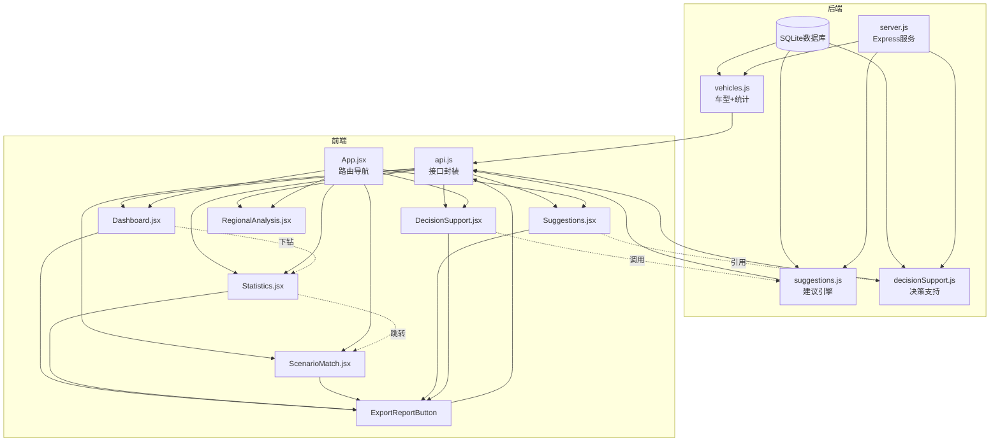
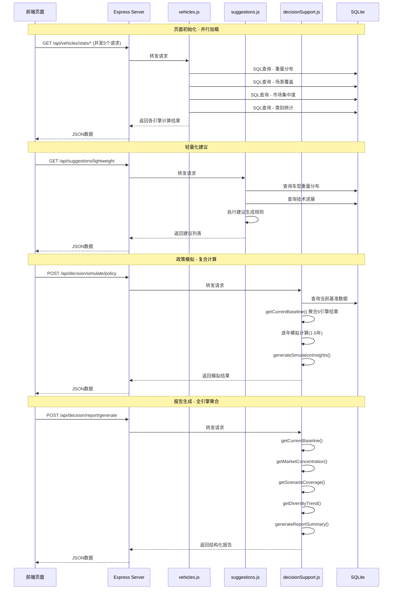

# 新能源汽车产品多元化供给监测平台 - 系统架构说明

## 文档信息

- **版本**: v1.0
- **日期**: 2024-06-09
- **适用范围**: 后端开发、前端开发、运维、数据分析
- **目的**: 帮助新接手的开发人员快速理解系统整体架构、模块分工与协作链路

---

## 1. 系统概述

本平台是一个面向新能源汽车行业的产品多元化供给监测与分析系统，核心目标是通过多维度数据分析，监测市场供给结构，识别供给缺口，提供发展建议，辅助产业决策。

### 1.1 核心能力

| 能力层级 | 说明 | 涉及模块 |
|---------|------|---------|
| **数据采集层** | 管理上百款新能源汽车的基础属性数据 | vehicles表、CRUD接口 |
| **分析引擎层** | 5大分析引擎并行计算，多维度透视市场结构 | 见第2章 |
| **决策支持层** | 政策模拟、车型推荐、报告生成 | decisionSupport.js |
| **可视化层** | 7个前端页面，从概览到下钻分析 | 见第4章 |

### 1.2 技术栈

| 层级 | 技术选型 | 说明 |
|------|---------|------|
| 后端 | Node.js + Express.js | RESTful API服务 |
| 数据库 | SQLite3 | 轻量级关系型数据库，存储车型、技术、统计数据 |
| 前端 | React 18 + Vite | 单页应用框架 |
| UI组件 | Ant Design 5.x | 企业级UI组件库 |
| 图表 | ECharts 5.x | 数据可视化 |
| 路由 | React Router 6.x | 前端路由管理 |
| HTTP | Axios | 前后端通信 |

---

## 2. 五大分析引擎详解

### 2.1 引擎总览

```
车型基础数据
    │
    ├─→ 类别重量分布引擎 → 重量分层统计
    ├─→ 场景适配覆盖引擎 → 场景匹配度分析
    ├─→ 市场集中度引擎  → 供需结构评估
    ├─→ 轻量化建议引擎  → 减重优化方案
    └─→ 多元化评分引擎  → 综合健康度评分
```

### 2.2 引擎一：类别重量分布引擎

**所在文件**: [vehicles.js](file:///Users/ding/Documents/SOLOCODE%203/0609/macmini/zj-00200-diverseev-5/backend/routes/vehicles.js#L262-L295)

#### 输入数据
- 所有在售车型的 `category`（类别）和 `curb_weight`（整备质量）
- 可选筛选条件：按类别过滤

#### 核心计算逻辑
```javascript
// 重量分档规则
CASE 
  WHEN curb_weight < 1200 THEN '<1200kg'      // 超轻量
  WHEN curb_weight >= 1200 AND curb_weight < 1500 THEN '1200-1500kg'  // 轻量化
  WHEN curb_weight >= 1500 AND curb_weight < 1800 THEN '1500-1800kg'  // 中型
  WHEN curb_weight >= 1800 AND curb_weight < 2200 THEN '1800-2200kg'  // 重型
  WHEN curb_weight >= 2200 AND curb_weight < 2800 THEN '2200-2800kg'  // 超重型
  ELSE '>=2800kg'                         // 特重型
END
```

#### 输出指标
- 各重量区间的车型数量
- 各区间包含的类别分布
- 整体重量分布形态

#### 消费接口
- API: `GET /api/vehicles/stats/weight-distribution`
- 前端页面: [Dashboard.jsx](file:///Users/ding/Documents/SOLOCODE%203/0609/macmini/zj-00200-diverseev-5/frontend/src/pages/Dashboard.jsx#L94-L116)（重量分布柱状图）、[Statistics.jsx](file:///Users/ding/Documents/SOLOCODE%203/0609/macmini/zj-00200-diverseev-5/frontend/src/pages/Statistics.jsx#L84-L112)（重量分布分析Tab）

---

### 2.3 引擎二：场景适配覆盖引擎

**所在文件**: [vehicles.js](file:///Users/ding/Documents/SOLOCODE%203/0609/macmini/zj-00200-diverseev-5/backend/routes/vehicles.js#L297-L335)

#### 输入数据
- 所有在售车型的 `scenarios`（适用场景，JSON数组）
- 场景定义：城市通勤、长途、载货

#### 核心计算逻辑
```javascript
// 对每个场景独立计算
for each scenario in ["城市通勤", "长途", "载货"]:
  total = 所有在售车型数
  matched = scenarios字段包含该场景的车型数
  lightweight_matched = 匹配场景且重量<1500kg的车型数
  
  coverage = (matched / total) * 100%
  lightweightRatio = (lightweight_matched / matched) * 100%
  hasGap = lightweight_matched === 0 OR lightweightRatio < 20%
```

#### 输出指标
| 字段 | 说明 | 阈值 |
|------|------|------|
| `coverage` | 场景覆盖度 | 健康值 ≥60% |
| `lightweightRatio` | 轻量化车型占比 | 健康值 ≥20% |
| `hasGap` | 是否存在轻量化供给缺口 | true/false |

#### 消费接口
- API: `GET /api/vehicles/stats/scenario-coverage`
- 前端页面: [Statistics.jsx](file:///Users/ding/Documents/SOLOCODE%203/0609/macmini/zj-00200-diverseev-5/frontend/src/pages/Statistics.jsx#L197-L242)（场景覆盖分析Tab）、[ScenarioMatch.jsx](file:///Users/ding/Documents/SOLOCODE%203/0609/macmini/zj-00200-diverseev-5/frontend/src/pages/ScenarioMatch.jsx)（场景匹配页）

---

### 2.4 引擎三：市场集中度引擎

**所在文件**: [vehicles.js](file:///Users/ding/Documents/SOLOCODE%203/0609/macmini/zj-00200-diverseev-5/backend/routes/vehicles.js#L370-L440)

#### 输入数据
- 所有在售车型的 `category` 和 `curb_weight`

#### 核心计算逻辑
```javascript
// 集中度双维度评估
heavyRatio = (重量≥1800kg车型数 / 总车型数) * 100%
largeCategoryRatio = (中大型+商用车型数 / 总车型数) * 100%

// 集中度判定
isOverConcentrated = heavyRatio > 40 OR largeCategoryRatio > 50

concentrationLevel = 
  if heavyRatio > 55 OR largeCategoryRatio > 60: "高度集中"
  else if heavyRatio > 40 OR largeCategoryRatio > 50: "中度集中"
  else: "分布均衡"
```

#### 输出指标
- `totalVehicles`: 在售车型总数
- `heavyRatio`: 重型车型占比
- `largeCategoryRatio`: 中大型+商用占比
- `concentrationLevel`: 集中度等级（高度集中/中度集中/分布均衡）
- `categoryDistribution`: 各类别数量与占比

#### 消费接口
- API: `GET /api/vehicles/stats/market-concentration`
- 前端页面: [Dashboard.jsx](file:///Users/ding/Documents/SOLOCODE%203/0609/macmini/zj-00200-diverseev-5/frontend/src/pages/Dashboard.jsx#L256-L319)（市场集中度卡片）、[Statistics.jsx](file:///Users/ding/Documents/SOLOCODE%203/0609/macmini/zj-00200-diverseev-5/frontend/src/pages/Statistics.jsx#L1004-L1152)（市场集中度Tab）

---

### 2.5 引擎四：轻量化建议引擎

**所在文件**: [suggestions.js](file:///Users/ding/Documents/SOLOCODE%203/0609/macmini/zj-00200-diverseev-5/backend/routes/suggestions.js#L38-L166)

#### 输入数据
- 所有在售车型的 `curb_weight`、`category`、`energy_density`
- `tech_progress` 表中的技术进展数据（材料、电池、结构技术）

#### 核心计算逻辑
```javascript
// 步骤1：计算整体轻量化指标
lightweightRatio = (重量<1500kg车型数 / 总车型数) * 100%

// 步骤2：分类别统计
for each category:
  计算该类别平均重量、轻量化车型数、轻量化占比

// 步骤3：生成多维度建议
generateSuggestions(overall, categoryStats, techProgress):
  ├─ 若 lightweightRatio < 30% → 紧急建议：提升轻量化比例
  ├─ 若 某类别平均重量 > 2000kg → 品类优化：该类别减重
  ├─ 若 存在材料技术 → 技术应用：推广top材料
  ├─ 若 存在电池技术 → 技术应用：提升能量密度
  ├─ 若 整体平均重量 > 1800kg → 政策引导：建立质量标准
  └─ 若 微型代步 < 10款 → 场景适配：补充城市通勤供给
```

#### 输出建议类型
| 类型 | 优先级 | 示例 |
|------|--------|------|
| `urgent` | 最高 | 提升轻量化车型供给比例 |
| `category` | 高 | 某品类车型减重优化 |
| `technology` | 中 | 推广某材料/电池技术 |
| `policy` | 中 | 建立整备质量分级标准 |
| `scenario` | 中 | 补充某场景的轻量化供给 |

#### 消费接口
- API: `GET /api/suggestions/lightweight`
- 前端页面: [Suggestions.jsx](file:///Users/ding/Documents/SOLOCODE%203/0609/macmini/zj-00200-diverseev-5/frontend/src/pages/Suggestions.jsx#L384-L479)（多元化与轻量化建议Tab）

---

### 2.6 引擎五：多元化评分引擎

**所在文件**: [suggestions.js](file:///Users/ding/Documents/SOLOCODE%203/0609/macmini/zj-00200-diverseev-5/backend/routes/suggestions.js#L168-L248)、[decisionSupport.js](file:///Users/ding/Documents/SOLOCODE%203/0609/macmini/zj-00200-diverseev-5/backend/routes/decisionSupport.js#L8-L16)

#### 输入数据
- 各类别车型数量分布
- 品牌数量、价格区间、续航区间

#### 核心计算逻辑
```javascript
// 基于类别分布均衡度计算
expectedPerCategory = totalVehicles / 4  // 4个类别理想均分

for each category:
  deviation = abs((actual - expected) / expected) * 100%

maxDeviation = max(all category deviations)

// 评分公式：最大偏差越大，评分越低
diversityScore = max(0, 100 - maxDeviation * 0.5)

// 等级划分
diversityLevel =
  if score >= 80: "优秀"
  else if score >= 60: "良好"
  else if score >= 40: "一般"
  else: "待提升"
```

#### 输出指标
- `diversityScore`: 0-100分的多元化评分
- `diversityLevel`: 优秀/良好/一般/待提升
- `categoryDistribution`: 各类别占比与偏差度
- `suggestions`: 针对薄弱环节的改进建议

#### 消费接口
- API: `GET /api/suggestions/diversity`
- 前端页面: [Dashboard.jsx](file:///Users/ding/Documents/SOLOCODE%203/0609/macmini/zj-00200-diverseev-5/frontend/src/pages/Dashboard.jsx#L224-L243)（多元化评分卡片）、[Suggestions.jsx](file:///Users/ding/Documents/SOLOCODE%203/0609/macmini/zj-00200-diverseev-5/frontend/src/pages/Suggestions.jsx#L582-L788)（多元化发展建议Tab）

---

## 3. 后端架构与API组织

### 3.1 后端目录结构

```
backend/
├── server.js              # 服务入口，路由注册
├── database.js            # 数据库连接与表结构定义
├── package.json           # 依赖管理
├── data/
│   └── diverseev.db       # SQLite数据库文件
├── scripts/
│   └── initData.js        # 初始化数据脚本（上百款车型数据）
└── routes/
    ├── vehicles.js        # 车型管理 + 3个分析引擎
    ├── suggestions.js     # 2个分析引擎（轻量化、多元化）
    └── decisionSupport.js # 决策支持：政策模拟、推荐、报告
```

### 3.2 API路由组织

**所在文件**: [server.js](file:///Users/ding/Documents/SOLOCODE%203/0609/macmini/zj-00200-diverseev-5/backend/server.js#L22-L24)

```javascript
// 三大路由模块
app.use("/api/vehicles", vehiclesRouter);       // 车型CRUD + 统计分析
app.use("/api/suggestions", suggestionsRouter); // 轻量化 + 多元化建议
app.use("/api/decision", decisionSupportRouter); // 政策模拟 + 推荐 + 报告
```

### 3.3 API接口清单

#### 3.3.1 车型数据接口 ([vehicles.js](file:///Users/ding/Documents/SOLOCODE%203/0609/macmini/zj-00200-diverseev-5/backend/routes/vehicles.js))

| 方法 | 路径 | 功能 | 对应引擎/页面 |
|------|------|------|-------------|
| GET | `/api/vehicles` | 车型列表（支持多条件筛选） | 车型管理页 |
| GET | `/api/vehicles/:id` | 车型详情 | 车型管理页 |
| POST | `/api/vehicles` | 新增车型 | 车型管理页 |
| PUT | `/api/vehicles/:id` | 更新车型 | 车型管理页 |
| DELETE | `/api/vehicles/:id` | 删除车型 | 车型管理页 |
| GET | `/api/vehicles/stats/category` | 类别统计 | 概览/统计页 |
| GET | `/api/vehicles/stats/weight-distribution` | **重量分布引擎** | 概览/统计页 |
| GET | `/api/vehicles/stats/scenario-coverage` | **场景覆盖引擎** | 统计/场景页 |
| GET | `/api/vehicles/stats/market-concentration` | **市场集中度引擎** | 概览/统计页 |
| GET | `/api/vehicles/match/scenario/:scenario` | 预设场景匹配 | 场景匹配页 |
| POST | `/api/vehicles/match/custom-scenario` | 自定义场景匹配 | 场景匹配页 |
| GET | `/api/vehicles/stats/tier-trend` | 分档趋势 | 统计页 |
| GET | `/api/vehicles/stats/diversity-trend` | 多元化趋势 | 统计页 |
| GET | `/api/vehicles/stats/regions` | 地区列表 | 地域分析页 |
| GET | `/api/vehicles/stats/region/:id/analysis` | 地区供给分析 | 地域分析页 |

#### 3.3.2 发展建议接口 ([suggestions.js](file:///Users/ding/Documents/SOLOCODE%203/0609/macmini/zj-00200-diverseev-5/backend/routes/suggestions.js))

| 方法 | 路径 | 功能 | 对应引擎/页面 |
|------|------|------|-------------|
| GET | `/api/suggestions/lightweight` | **轻量化建议引擎** | 发展建议页 |
| GET | `/api/suggestions/diversity` | **多元化评分引擎** | 概览/发展建议页 |
| GET | `/api/suggestions/tech-progress` | 技术进展列表 | 发展建议页 |
| POST | `/api/suggestions/tech-progress` | 新增技术进展 | 发展建议页 |

#### 3.3.3 决策支持接口 ([decisionSupport.js](file:///Users/ding/Documents/SOLOCODE%203/0609/macmini/zj-00200-diverseev-5/backend/routes/decisionSupport.js))

| 方法 | 路径 | 功能 | 对应页面 |
|------|------|------|---------|
| GET | `/api/decision/simulate/parameters` | 模拟参数配置 | 决策支持页 |
| POST | `/api/decision/simulate/policy` | 政策效果模拟 | 决策支持页 |
| POST | `/api/decision/recommend` | 智能车型推荐 | 决策支持页 |
| POST | `/api/decision/report/generate` | 分析报告生成 | 各页面导出按钮 |

### 3.4 数据库设计

**所在文件**: [database.js](file:///Users/ding/Documents/SOLOCODE%203/0609/macmini/zj-00200-diverseev-5/backend/database.js)

#### 核心表结构

| 表名 | 用途 | 关键字段 |
|------|------|---------|
| `vehicles` | 车型基础库 | name, brand, category, curb_weight, range, price, scenarios, material, energy_density |
| `tech_progress` | 技术进展库 | type (material/battery/structure), name, weight_reduction, efficiency_improvement, maturity_level |
| `annual_diversity_stats` | 年度多元化统计 | stat_year, diversity_score, 各类别count/ratio, heavy_ratio, brand_count |
| `tier_trend_stats` | 分档趋势统计 | stat_date, tier_name, vehicle_count, indicator_type |
| `regions` | 地区信息 | name, code, terrain_type, climate, typical_usage |
| `region_vehicle_requirements` | 地区车型需求 | region_id, category, min/max_range, min/max_weight, min/max_price, priority |

### 3.5 后端协作链路

```
HTTP Request
    │
    ▼
server.js (路由分发)
    │
    ├─→ /api/vehicles/* → vehicles.js
    │     ├─ CRUD操作 → 数据库vehicles表
    │     ├─ 类别重量分布引擎 → SQL分组统计
    │     ├─ 场景覆盖引擎 → 多场景并行查询
    │     ├─ 市场集中度引擎 → 双维度集中度计算
    │     └─ 场景匹配 → 按条件筛选 + 轻量化排序
    │
    ├─→ /api/suggestions/* → suggestions.js
    │     ├─ 轻量化建议引擎 → 指标计算 + 规则匹配
    │     └─ 多元化评分引擎 → 偏差度计算 + 评分
    │
    └─→ /api/decision/* → decisionSupport.js
          ├─ 政策模拟 → 多参数复合计算模型
          ├─ 车型推荐 → 5维度加权评分
          └─ 报告生成 → 多引擎数据聚合 + 结构化输出
    │
    ▼
JSON Response → 前端页面
```

---

## 4. 前端页面与联动下钻

### 4.1 前端目录结构

```
frontend/src/
├── App.jsx               # 主应用，路由配置，导航菜单
├── api.js                # API封装，三个模块的接口
├── main.jsx              # 应用入口
├── index.css             # 全局样式
├── components/
│   └── ExportReportButton.jsx  # 通用报告导出组件
├── hooks/
│   └── useReportExport.js      # 报告导出逻辑Hook
└── pages/
    ├── Dashboard.jsx      # 数据概览（入口页）
    ├── VehicleList.jsx    # 车型管理
    ├── Statistics.jsx     # 统计分析（6个Tab）
    ├── ScenarioMatch.jsx  # 场景匹配（预设+自定义）
    ├── Suggestions.jsx    # 发展建议（3个Tab）
    ├── RegionalAnalysis.jsx  # 地域分析
    └── DecisionSupport.jsx   # 决策支持（政策模拟+推荐）
```

### 4.2 页面功能与数据流

#### 4.2.1 数据概览页 ([Dashboard.jsx](file:///Users/ding/Documents/SOLOCODE%203/0609/macmini/zj-00200-diverseev-5/frontend/src/pages/Dashboard.jsx))

**核心功能**: 全维度数据总览，异常预警

**并行加载的5个API**:
```javascript
Promise.all([
  vehicleAPI.getVehicles({ status: "在售" }),      // 车型基础数
  vehicleAPI.getCategoryStats(),                   // 类别统计
  vehicleAPI.getMarketConcentration(),             // 市场集中度引擎
  suggestionAPI.getDiversity(),                    // 多元化评分引擎
  vehicleAPI.getWeightDistribution(),              // 重量分布引擎
])
```

**展示模块**:
- 4个统计卡片：车型总数、平均重量、平均续航、平均售价
- 多元化评分展示（分数+等级+进度条）
- 类别分布饼图
- 市场集中度进度条（中大型占比、重型占比）
- 整备质量分布柱状图
- 各类别平均指标卡片

**联动入口**:
- 点击"导出综合报告" → 调用决策支持的报告生成API

---

#### 4.2.2 统计分析页 ([Statistics.jsx](file:///Users/ding/Documents/SOLOCODE%203/0609/macmini/zj-00200-diverseev-5/frontend/src/pages/Statistics.jsx))

**6个Tab下钻分析**:

| Tab | 核心图表 | 调用API | 下钻能力 |
|-----|---------|---------|---------|
| 重量分布分析 | 整体重量柱状图、单类别重量分布、重量构成堆叠图、箱线图 | `weight-distribution` | 下拉选择类别，动态加载该类别分布 |
| 类别统计分析 | 多指标对比柱状图、类别详情卡片 | `category` | 无 |
| 场景覆盖分析 | 覆盖度+轻量化占比双轴图、场景详情卡片 | `scenario-coverage` | 点击场景卡片可跳转场景匹配页 |
| 市场集中度 | 多元化雷达图、集中度详情、类别占比条 | `market-concentration` | 无 |
| 分档指标趋势 | 折线趋势图、堆叠面积图、各档位卡片 | `tier-trend` | 环比增长计算、趋势预警 |
| 多元化趋势 | 评分趋势线、类别占比变化、堆叠柱状图、年度卡片 | `diversity-trend` | 洞察自动生成、偏差分析 |

**联动入口**:
- 每个Tab可独立导出对应分析报告
- 场景覆盖分析可跳转场景匹配页

---

#### 4.2.3 场景匹配页 ([ScenarioMatch.jsx](file:///Users/ding/Documents/SOLOCODE%203/0609/macmini/zj-00200-diverseev-5/frontend/src/pages/ScenarioMatch.jsx))

**两种匹配模式**:

**模式一：预设场景匹配**
- 场景切换：城市通勤 / 长途 / 载货
- 调用API: `GET /api/vehicles/match/scenario/:scenario`
- 展示内容：
  - 场景描述与理想重量区间
  - 轻量化车型占比环形图
  - 重量-续航散点图（点大小=价格，颜色=是否轻量化）
  - 轻量化推荐车型列表（优先展示）
  - 全部匹配车型列表

**模式二：自定义场景匹配**
- 配置项：重量范围、续航范围、价格范围、车型类别、适用场景、轻量化偏好
- 调用API: `POST /api/vehicles/match/custom-scenario`
- 返回内容：
  - 匹配统计（数量、覆盖度、轻量化占比）
  - 供给缺口分析
  - 优化建议（如条件过严提示放宽）
  - 各类别统计详情
  - 匹配车型列表

**联动入口**:
- 导出场景分析报告
- 点击车型可查看详情

---

#### 4.2.4 发展建议页 ([Suggestions.jsx](file:///Users/ding/Documents/SOLOCODE%203/0609/macmini/zj-00200-diverseev-5/frontend/src/pages/Suggestions.jsx))

**3个Tab下钻分析**:

| Tab | 调用API | 核心展示 |
|-----|---------|---------|
| 多元化与轻量化建议 | `lightweight` | 6条发展建议卡片（紧急/技术/品类/政策/场景）、各类别轻量化柱状图、轻量化进度条 |
| 技术进展与应用 | `tech-progress` | 技术雷达图（减重/提效/成熟度/前景）、Top10减重技术柱状图、三类技术（材料/电池/结构）列表 |
| 多元化发展建议 | `diversity` | 核心结论Alert、改进建议、状态分布、类别偏差可视化、发展路径（短期/中期/长期） |

---

#### 4.2.5 决策支持页 ([DecisionSupport.jsx](file:///Users/ding/Documents/SOLOCODE%203/0609/macmini/zj-00200-diverseev-5/frontend/src/pages/DecisionSupport.jsx))

**两大核心功能**:

**功能一：政策效果模拟**
- 5个可调参数（滑块）：
  - 轻量化材料普及率
  - 电池能量密度提升
  - 新能源汽车补贴力度
  - 重型车限制政策
  - 微型车专项补贴
- 模拟周期：1年/3年/5年
- 调用API: `POST /api/decision/simulate/policy`
- 输出：逐年预测数据、多维趋势图、政策洞察

**功能二：智能车型推荐**
- 输入条件：预算区间、主要场景、次要场景、偏好类别、最低续航、最大重量、轻量化偏好
- 5维度加权评分：
  - 价格匹配度（25%）
  - 场景匹配度（30%）
  - 续航表现（20%）
  - 轻量化优势（10-15%）
  - 能量密度（10%）
- 调用API: `POST /api/decision/recommend`
- 输出：TopN推荐车型、推荐理由、综合摘要

---

### 4.3 页面联动下钻链路

```
Dashboard（数据概览）
    │
    ├─ 发现集中度预警 → 点击跳转到 Statistics → 市场集中度Tab
    ├─ 发现场景覆盖缺口 → 点击跳转到 Statistics → 场景覆盖分析Tab
    ├─ 发现重量分布异常 → 点击跳转到 Statistics → 重量分布分析Tab
    └─ 导出综合报告 → 调用决策支持报告API
        │
Statistics（统计分析）
    │
    ├─ 重量分布Tab → 选择类别 → 动态加载该类别分布数据
    ├─ 场景覆盖Tab → 点击某场景 → 跳转到 ScenarioMatch 预设场景匹配
    └─ 各Tab均可独立导出对应报告
        │
ScenarioMatch（场景匹配）
    │
    ├─ 预设场景 → 切换场景 → 重新请求匹配数据
    ├─ 自定义场景 → 提交表单 → 获取匹配结果
    ├─ 发现供给缺口 → 查看缺口分析与建议
    └─ 点击车型 → 查看车型详情
        │
Suggestions（发展建议）
    │
    ├─ 查看技术详情 → 了解减重/提效潜力
    ├─ 查看建议 → 关联到具体技术或场景
    └─ 导出建议报告
        │
DecisionSupport（决策支持）
    │
    ├─ 政策模拟 → 调整参数 → 预测未来3-5年趋势
    ├─ 车型推荐 → 输入需求 → 获取个性化推荐
    └─ 生成报告 → 聚合多引擎数据 → 结构化报告输出
        │
RegionalAnalysis（地域分析）
    │
    └─ 选择地区 → 加载该地区供给分析 → 查看匹配车型
```

### 4.4 API调用封装

**所在文件**: [api.js](file:///Users/ding/Documents/SOLOCODE%203/0609/macmini/zj-00200-diverseev-5/frontend/src/api.js)

前端将后端API按业务领域封装为三个对象：

```javascript
export const vehicleAPI = { ... }      // 对应 /api/vehicles/*
export const suggestionAPI = { ... }   // 对应 /api/suggestions/*
export const decisionAPI = { ... }     // 对应 /api/decision/*
export const metaAPI = { ... }         // 对应 /api/meta
```

---

## 5. 数据流与模块依赖架构图

### 5.1 整体数据流图

```mermaid
graph TD
    %% 数据源层
    subgraph 数据源层
        A[车型基础数据<br/>vehicles表<br/>100+款车型]
        B[技术进展数据<br/>tech_progress表]
        C[历史统计数据<br/>annual_diversity_stats]
        D[地区需求数据<br/>regions表]
    end

    %% 分析引擎层
    subgraph 分析引擎层
        E[类别重量分布引擎]
        F[场景适配覆盖引擎]
        G[市场集中度引擎]
        H[轻量化建议引擎]
        I[多元化评分引擎]
    end

    %% 决策支持层
    subgraph 决策支持层
        J[政策效果模拟模型]
        K[智能车型推荐算法]
        L[分析报告生成器]
    end

    %% API层
    subgraph API层
        M[/api/vehicles/*]
        N[/api/suggestions/*]
        O[/api/decision/*]
    end

    %% 前端页面层
    subgraph 前端页面层
        P[数据概览 Dashboard]
        Q[统计分析 Statistics]
        R[场景匹配 ScenarioMatch]
        S[发展建议 Suggestions]
        T[决策支持 DecisionSupport]
        U[地域分析 RegionalAnalysis]
    end

    %% 数据流
    A --> E
    A --> F
    A --> G
    A --> H
    A --> I
    B --> H
    C --> I
    D --> U

    E --> M
    F --> M
    G --> M

    H --> N
    I --> N

    E --> J
    F --> J
    G --> J
    H --> J
    I --> J
    A --> K
    E --> L
    F --> L
    G --> L
    H --> L
    I --> L

    J --> O
    K --> O
    L --> O

    M --> P
    M --> Q
    M --> R
    M --> U
    N --> P
    N --> Q
    N --> S
    O --> T
    O --> P
    O --> Q
    O --> R
    O --> S
```

### 5.2 模块依赖关系图



### 5.3 五大引擎协作时序



---

## 6. 关键代码索引

### 6.1 分析引擎核心代码

| 引擎 | 文件 | 起始行 | 关键函数 |
|------|------|--------|---------|
| 类别重量分布 | [vehicles.js](file:///Users/ding/Documents/SOLOCODE%203/0609/macmini/zj-00200-diverseev-5/backend/routes/vehicles.js#L262) | L262 | `GET /stats/weight-distribution` |
| 场景适配覆盖 | [vehicles.js](file:///Users/ding/Documents/SOLOCODE%203/0609/macmini/zj-00200-diverseev-5/backend/routes/vehicles.js#L297) | L297 | `GET /stats/scenario-coverage` |
| 市场集中度 | [vehicles.js](file:///Users/ding/Documents/SOLOCODE%203/0609/macmini/zj-00200-diverseev-5/backend/routes/vehicles.js#L370) | L370 | `GET /stats/market-concentration` |
| 轻量化建议 | [suggestions.js](file:///Users/ding/Documents/SOLOCODE%203/0609/macmini/zj-00200-diverseev-5/backend/routes/suggestions.js#L38) | L38 | `GET /lightweight` + `generateSuggestions()` |
| 多元化评分 | [suggestions.js](file:///Users/ding/Documents/SOLOCODE%203/0609/macmini/zj-00200-diverseev-5/backend/routes/suggestions.js#L168) | L168 | `GET /diversity` |
| 多元化评分(共用) | [decisionSupport.js](file:///Users/ding/Documents/SOLOCODE%203/0609/macmini/zj-00200-diverseev-5/backend/routes/decisionSupport.js#L8) | L8 | `calculateDiversityScore()` |
| 基准数据聚合 | [decisionSupport.js](file:///Users/ding/Documents/SOLOCODE%203/0609/macmini/zj-00200-diverseev-5/backend/routes/decisionSupport.js#L18) | L18 | `getCurrentBaseline()` |
| 政策模拟 | [decisionSupport.js](file:///Users/ding/Documents/SOLOCODE%203/0609/macmini/zj-00200-diverseev-5/backend/routes/decisionSupport.js#L113) | L113 | `POST /simulate/policy` |
| 车型推荐 | [decisionSupport.js](file:///Users/ding/Documents/SOLOCODE%203/0609/macmini/zj-00200-diverseev-5/backend/routes/decisionSupport.js#L356) | L356 | `POST /recommend` |
| 报告生成 | [decisionSupport.js](file:///Users/ding/Documents/SOLOCODE%203/0609/macmini/zj-00200-diverseev-5/backend/routes/decisionSupport.js#L666) | L666 | `POST /report/generate` |

### 6.2 前端核心页面

| 页面 | 文件 | 主要功能 |
|------|------|---------|
| 数据概览 | [Dashboard.jsx](file:///Users/ding/Documents/SOLOCODE%203/0609/macmini/zj-00200-diverseev-5/frontend/src/pages/Dashboard.jsx) | 5API并行加载、多图表展示 |
| 统计分析 | [Statistics.jsx](file:///Users/ding/Documents/SOLOCODE%203/0609/macmini/zj-00200-diverseev-5/frontend/src/pages/Statistics.jsx) | 6个Tab下钻分析 |
| 场景匹配 | [ScenarioMatch.jsx](file:///Users/ding/Documents/SOLOCODE%203/0609/macmini/zj-00200-diverseev-5/frontend/src/pages/ScenarioMatch.jsx) | 预设+自定义场景匹配 |
| 发展建议 | [Suggestions.jsx](file:///Users/ding/Documents/SOLOCODE%203/0609/macmini/zj-00200-diverseev-5/frontend/src/pages/Suggestions.jsx) | 3个Tab建议展示 |
| 决策支持 | [DecisionSupport.jsx](file:///Users/ding/Documents/SOLOCODE%203/0609/macmini/zj-00200-diverseev-5/frontend/src/pages/DecisionSupport.jsx) | 政策模拟+车型推荐 |
| API封装 | [api.js](file:///Users/ding/Documents/SOLOCODE%203/0609/macmini/zj-00200-diverseev-5/frontend/src/api.js) | 三大模块接口封装 |
| 应用路由 | [App.jsx](file:///Users/ding/Documents/SOLOCODE%203/0609/macmini/zj-00200-diverseev-5/frontend/src/App.jsx) | 导航菜单与路由配置 |

---

## 7. 快速问题定位指南

### 7.1 常见问题索引

| 问题现象 | 可能原因 | 排查路径 |
|---------|---------|---------|
| 重量分布数据异常 | 重量分档逻辑问题 | [vehicles.js L265-L273](file:///Users/ding/Documents/SOLOCODE%203/0609/macmini/zj-00200-diverseev-5/backend/routes/vehicles.js#L265-L273) |
| 场景覆盖度不准 | scenarios字段格式问题 | 检查vehicles表scenarios字段是否为有效JSON |
| 多元化评分计算错误 | 偏差度公式问题 | [suggestions.js L213-L214](file:///Users/ding/Documents/SOLOCODE%203/0609/macmini/zj-00200-diverseev-5/backend/routes/suggestions.js#L213-L214) |
| 轻量化建议不生成 | 规则条件不满足 | [suggestions.js L96-L166](file:///Users/ding/Documents/SOLOCODE%203/0609/macmini/zj-00200-diverseev-5/backend/routes/suggestions.js#L96-L166) |
| 政策模拟结果异常 | 模型参数问题 | [decisionSupport.js L129-L146](file:///Users/ding/Documents/SOLOCODE%203/0609/macmini/zj-00200-diverseev-5/backend/routes/decisionSupport.js#L129-L146) |
| 车型推荐评分不准 | 权重设置问题 | [decisionSupport.js L415-L447](file:///Users/ding/Documents/SOLOCODE%203/0609/macmini/zj-00200-diverseev-5/backend/routes/decisionSupport.js#L415-L447) |

### 7.2 新增分析指标的步骤

1. 在 `vehicles.js` 或对应路由文件中新增API端点
2. 在 `api.js` 中添加对应的前端调用方法
3. 在目标页面中调用新API并展示数据
4. 如需在报告中包含，在 `decisionSupport.js` 的 `generateReport` 中添加对应section

---

## 8. 维护建议

1. **数据质量**: 定期检查 `vehicles` 表的 `scenarios` 字段格式，确保为有效JSON数组
2. **性能优化**: 大数据量下考虑为 `category`、`curb_weight`、`status` 字段建立索引
3. **引擎扩展**: 新增分析引擎时，建议在 `decisionSupport.js` 中统一管理，便于报告聚合
4. **阈值调整**: 各引擎的健康阈值（如轻量化20%、重型40%）可根据业务需求在对应代码中调整

---

**文档结束**

> 本文档归档于 `ARCHITECTURE.md`，随代码版本同步更新。新接手开发人员请先通读本文档，再结合具体代码进行开发。
